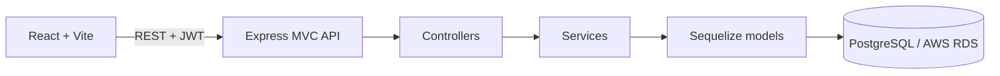

# Architecture notes

## Backend layers

- `src/routes` maps HTTP paths to controller functions.
- `src/controllers` validates request data with Joi and maps domain results to JSON.
- `src/services` owns filtering, pagination, salary serialization, and PostgreSQL analytics.
- `src/models` defines Sequelize attributes, enum-backed columns, indexes, and associations.
- `src/database/sequelize.ts` owns the connection pool, SSL configuration, and dialect settings.
- `src/database/bootstrap.ts` imports the model registry, authenticates the connection, and optionally synchronizes the schema.

The model registry defines a one-to-many `Employee.hasMany(SalaryHistory)` association. The foreign key uses `ON DELETE CASCADE` and the alias `salaryHistory`, which is the relationship name used by employee queries.

## API surface

| Method  | Path                           | Purpose                                             |
| ------- | ------------------------------ | --------------------------------------------------- |
| `GET`   | `/api/health`                  | Process health check                                |
| `POST`  | `/api/auth/login`              | Issue an HR administrator JWT                       |
| `POST`  | `/api/auth/register`           | Create the first HR user during local bootstrap     |
| `GET`   | `/api/employees`               | Paginated, searchable, and filterable employee list |
| `GET`   | `/api/employees/:id`           | Employee and ordered salary history                 |
| `PATCH` | `/api/employees/:id/salary`    | Append a salary revision                            |
| `GET`   | `/api/analytics/pay-by-group`  | Average and median current pay by a fixed grouping  |
| `GET`   | `/api/analytics/payroll-trend` | Twelve-month active-employee payroll trend          |

Salary amounts cross the API boundary as decimal strings because PostgreSQL `BIGINT` values can exceed JavaScript's safe-integer range. Database queries bind user values. Analytics SQL interpolates only a fixed allowlist of grouping columns and the validated month/quarter interval.

## Database lifecycle

1. The server requires `DATABASE_URL`, authenticates with PostgreSQL, and starts the HTTP listener.
2. `DB_SYNC_ON_START=true` additionally calls non-destructive `sequelize.sync()` at startup. It defaults to `false` so normal application startup never changes the production schema.
3. `npm run db:sync` explicitly creates missing tables, foreign keys, unique constraints, and indexes.
4. `npm run db:seed` synchronizes first, then generates a fixed Faker data set and writes employee and salary rows in configurable batches inside one transaction.

The schema synchronization command is intended for this MVP. Versioned database migrations should be introduced before production schema evolution.

## Configuration

Connection and runtime settings are documented in `backend/.env.example`:

- `DB_SSL`, `DB_SSL_REJECT_UNAUTHORIZED`, `DB_POOL_MAX`, and `DB_LOGGING` control PostgreSQL connectivity and pool behavior.
- `DB_SYNC_ON_START` controls optional startup synchronization.
- `SEED_EMPLOYEE_COUNT`, `SEED_BATCH_SIZE`, `SEED_RANDOM_SEED`, `SEED_REFERENCE_DATE`, and `SEED_TRUNCATE` control deterministic seeding.

The frontend uses `VITE_API_URL` as the API origin and sends the JWT as a Bearer token. Its default origin is `http://localhost:4000`.

## Local authentication and database checks

There is intentionally no open public signup endpoint. The application supports one-time creation of the first database-backed HR user through `POST /api/auth/register`, gated by `ALLOW_INITIAL_REGISTRATION=true` and an empty `users` table. After the first account is created, registration is permanently closed for that database.

## One-time database login bootstrap

1. Run `npm run db:sync` from `backend/` to create the `users` table.
2. Set `ALLOW_INITIAL_REGISTRATION=true` in `backend/.env` and restart the API.
3. In Postman, send `POST http://localhost:4000/api/auth/register` with `{ "email": "hr.admin@acme.com", "password": "Choose-a-strong-password" }`. The password must be at least 12 characters.
4. A successful request returns `201`; any later request returns `409`. Set `ALLOW_INITIAL_REGISTRATION=false` and restart the API.
5. Send `POST /api/auth/login` with the new credentials and use the returned token as `Authorization: Bearer <token>`.

The environment-configured administrator can log in only while the `users` table is empty. `npm run auth:token` is a local utility and does not create a user.
## Fixed 10,000-employee seed

Run `npm run seed:10k` from `backend/` to replace employee and salary data with 10,000 employees. Run `npm run seed:10k:append` to add 10,000 more without deleting existing employee or salary rows. Both commands synchronize the schema, write in batches inside one transaction, and generate initial salary plus revisions. Login users are preserved.
