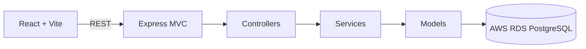

# Architecture notes

The implementation temporarily swaps the model repository for deterministic in-memory demo data. This makes the UI fully interactive today; database configuration is isolated in `backend/src/config/database.js` and model replacement does not affect the API contract. Client lists are paginated by API contract from the start, preparing for database-backed queries later.
